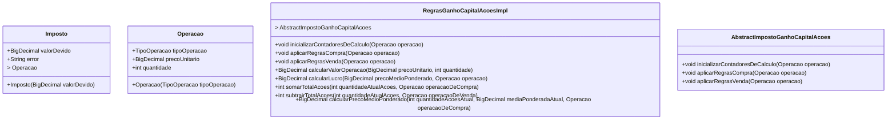
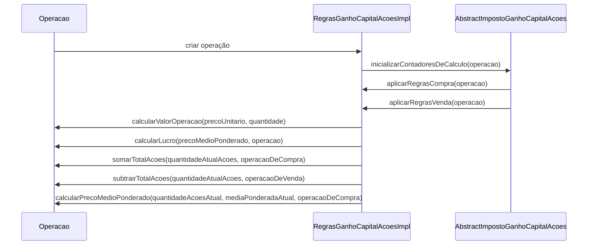

# Calculator

Projeto criado para calcular imposto sobre ganhos com operações financeiras, com ações.

## Índice

1. [Executar o Programa](#executar-o-programa)
2. [Diagrama de Classe de Domínio](#classe-de-domínio)

## Linguagem de Desenvolvimento e Gerenciador de Depêndencias

- JAVA
- MAVEN

## Versões

1. JRE 14.0.2 ou superior
2. JDK 14.0.2 ou superior
3. Maven 3.5.4 ou superior

## SETUP de Execução

Necessário ter a JDK (versão acima) e MAVEN instalados na máquina que irá executar o programa.

## Bibliotecas Externas Utilizadas

|                        BIBLIOTECA                        |                                                         NECESSIDADE                                                         |                                                                                                                                                                    CONFIGURAÇÃO                                                                                                                                                                    |
|:--------------------------------------------------------:|:---------------------------------------------------------------------------------------------------------------------------:|:--------------------------------------------------------------------------------------------------------------------------------------------------------------------------------------------------------------------------------------------------------------------------------------------------------------------------------------------------:|
|                  maven-surefire-plugin                   |               Fazer com que o MAVEN entenda e execução dos **testes unitários** através do comando "mvn test"               |                                                                                                                                                                        N/A                                                                                                                                                                         |
|                          lombok                          | Encapsular a criação de métodos **"default" (GETTERS, SETTERS, BUILDERS, OF e etc)** que quando escrito só poluem o código. | É necessário realizar a configuração do LOMBOK, para que a IDE utilizada entenda as "anotações", para tal basta seguir as configurações abaixo para cada IDE.    1. [ECLIPSE](https://projectlombok.org/setup/eclipse)   2. [VSCODE](https://projectlombok.org/setup/vscode)   3. [INTELLIJ](https://projectlombok.org/setup/intellij)|

## Executar o Programa

1. Acessar a pasta "**calculator**" e executar o comando "**mvn clean install**"
2. Acessar a pasta **calculator/target/**
3. Executar o comando "**java -jar calculatorimposto-1.0-jar-with-dependencies.jar**"

## Classe de domínio

## Diagrama de Sequência

