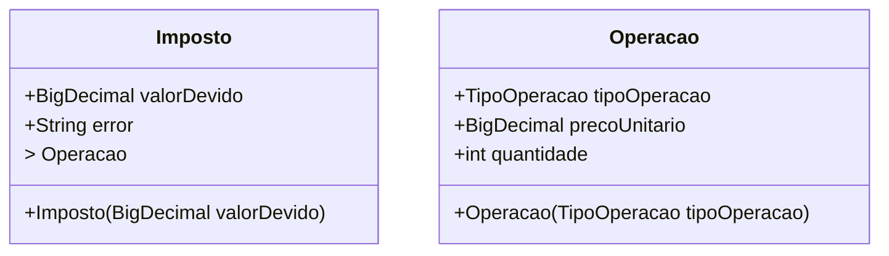

# Calculator 
Projeto criado para calcular imposto sobre ganhos com operações financeiras, com ações.

## Linguagem de Desenvolvimento e Gerenciador de Depêndencias:
- JAVA
- MAVEN

## Versões:
1. JRE 14.0.2 ou superior
2. JDK 14.0.2 ou superior
3. Maven 3.5.4 ou superior

## SETUP de Execução:
Necessário ter a JDK (versão acima) e MAVEN instalados na máquina que irá executar o programa.

## Bibliotecas Externas Utilizadas:
|                        BIBLIOTECA                        |                                                         NECESSIDADE                                                         |                                                                                                                                                                    CONFIGURAÇÃO                                                                                                                                                                    |
|:--------------------------------------------------------:|:---------------------------------------------------------------------------------------------------------------------------:|:--------------------------------------------------------------------------------------------------------------------------------------------------------------------------------------------------------------------------------------------------------------------------------------------------------------------------------------------------:|
|                  maven-surefire-plugin                   |               Fazer com que o MAVEN entenda e execução dos **testes unitários** através do comando "mvn test"               |                                                                                                                                                                        N/A                                                                                                                                                                         | 
|                          lombok                          | Encapsular a criação de métodos **"default" (GETTERS, SETTERS, BUILDERS, OF e etc)** que quando escrito só poluem o código. | É necessário realizar a configuração do LOMBOK, para que a IDE utilizada entenda as "anotações", para tal basta seguir as configurações abaixo para cada IDE.    1. [ECLIPSE](https://projectlombok.org/setup/eclipse)   2. [VSCODE](https://projectlombok.org/setup/vscode)   3. [INTELLIJ](https://projectlombok.org/setup/intellij) | 
|                     jackson-databind                     |                                  Serializar/Deserializar **STRINGS** em formato **JSON**.                                   |                                                                                                                                                                        N/A                                                                                                                                                                         |
|                   jackson-annotations                    |                     Serializar/Deserializar através de "anotações" da LIB, ao invés de "interar" STRINGS.                     |                                                                                                                                                                        N/A                                                                                                                                                                         |
|                    junit-jupiter-api                     |                                      Escrever testes unitários de forma menos verbosa.                                      |                                                                                                                                                                        N/A                                                                                                                                                                         |
|                   junit-jupiter-engine                   |                                          Permitir a execução dos testes unitários.                                          |                                                                                                                                                                                                                                                                                                                                                    |

## Topologia Arquitetural da Aplicação:
1. Forte utilização de interfaces com o intuito de aplicar a inversão de depêndencia, favorecendo alterações nas implementações e transparência para os "consumidores".
2. Fragmentação da regra de negócio, quebrando-a em **"regras menores"** (**IRegrasGanhoCapitalAcoes**), tornando possível a criação de **"regras maiores"** utilizando a composição das menores.
3. Criação de classes de **"domain"**,**"in"** e **"out"** com o objetivo de separar a representação do contrato (JSON) e entidades utilizadas na aplicação das regras de negócio. Numa eventual modularização, o módulo de negócio não precisaria da adição de LIBs externas, por exemplo.
4. Criação da classe "**AbstractImpostoGanhoCapitalAcoes**", para encapsular os atributos de "suporte" aos cálculos realizados bem como, definir um comportamento padrão para a execução dos calculos.
5. Criação da classe "**ImpostoGanhoCapitalCalculatorImpl**", que basicamente "junta" todos os pontos descritos acima e assim aplica a regra final (**calcular imposto**), basicamente uma classe orquestradora que contém pouquissímas regras de negócio.
6. Elencando todos os pontos acima, possíveis evoluções no código poderiam ser feitas adicionando OU estendendo as classes / interfaces envolvidas, sem gerar grandes impactos nas regras existentes. 

## Executar o Programa:
1. Acessar a pasta "**calculator**" e executar o comando "**mvn clean install**"
2. Acessar a pasta **calculator/target/**
3. Executar o comando "**java -jar calculatorimposto-1.0-jar-with-dependencies.jar**"

## Diagrama de classe de domínio:
